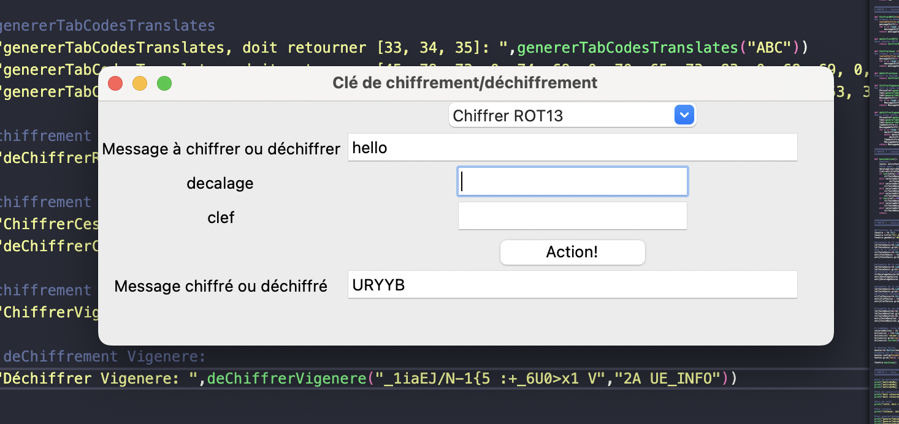

# 🔐 Maquette Python - Outil de chiffrement et déchiffrement

Projet pédagogique réalisé en collaboration avec deux collègues. 
Cette application Python permet de **chiffrer et déchiffrer des messages** en utilisant les méthodes **ROT13**, **César** et **Vigenère**, via une **interface simple avec Tkinter**.

---

## 🎯 Objectifs

- Concevoir un logiciel fonctionnel pour chiffrer/déchiffrer du texte
- Proposer une interface utilisateur simple (Tkinter)
- Implémenter plusieurs méthodes de chiffrement :
  - **ROT13** : décalage de 13 lettres
  - **César** : décalage paramétrable
  - **Vigenère** : chiffrement basé sur une clé répétée

---

## 🛠️ Technologies utilisées

- **Python 3.x** : langage principal
- **Tkinter** : interface graphique
- **ASCII** : gestion des caractères pour le chiffrement
- **Notions d’algorithmique** : fonctions ROT13, César, Vigenère

---

## 🖥️ Fonctionnalités de l’application

1. **Zone de saisie** : entrer le message à chiffrer ou déchiffrer
2. **Sélection du mode** : liste déroulante pour choisir entre ROT13, César, Vigenère
3. **Paramètres** :
   - Décalage pour César
   - Clé pour Vigenère
4. **Bouton "Action !"** : lance le chiffrement ou déchiffrement
5. **Affichage du résultat** : la zone de sortie montre le message codé/décodé

⚠️ Le texte est limité à 300 caractères et la clé à 50 caractères.

---

## 📊 Limites et perspectives d’amélioration

| Points forts | Limites |
|--------------|---------|
| ✔ Fonctionnel pour ROT13, César, Vigenère | ❌ Peu de contrôle des erreurs utilisateurs |
| ✔ Détection des dépassements de longueur | ❌ Interface peu ergonomique (tous les champs affichés en permanence) |
| ✔ Bonne compréhension des algorithmes de chiffrement | ❌ Pas de gestion de fichiers externes (uniquement texte saisi à la main) |

> 👉 Le programme fonctionne si l'utilisateur connaît les bases du chiffrement, mais il manque d’assistances et de guides pour un utilisateur novice.

---

## ✅ Apports pédagogiques

- Compréhension des algorithmes de chiffrement par décalage
- Manipulation des **listes ASCII**
- Maîtrise des **fonctions et structures de contrôle en Python**
- Découverte de **Tkinter** pour créer une interface graphique
- Travail d’équipe sur la gestion d’un projet informatique

---

## 📁 Structure du projet

```
maquettepython/
├── main.py        # Code principal avec interface Tkinter
├── README.md                 # Ce document
└── captures/                 # Captures d’écran de l’application 
```

---

## 🚀 Lancer l'application

Dans le terminal :
```bash
python3 main.py
```

L’interface graphique s’ouvrira pour tester les différents modes de chiffrement.

---
---

## 🖼️ Aperçu global du projet



---

## 🎯 Prochaines évolutions possibles

- Améliorer le contrôle de saisie (types, champs dynamiques selon le mode)
- Ajouter la possibilité de **charger un fichier texte** à chiffrer
- Améliorer l’esthétique (Tkinter customisé ou passage à une interface web)
- Implémenter un mode de **chiffrement de fichiers entiers**
